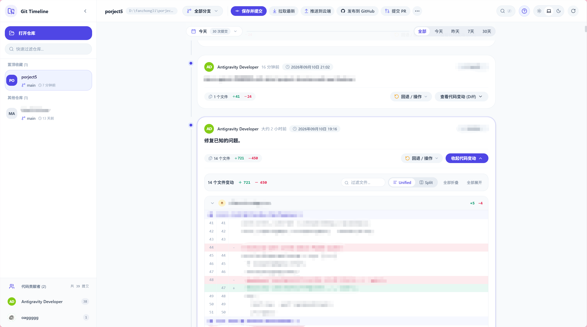

# Git-Timeline

让 Git 提交更简单更美观。一款专注于本地 Git 历史可视化查看、代码审查与高频 Git 操作的现代化全栈 Web 应用。基于 React 19、Vite 6、Express 4 与 TypeScript 5 构建，采用直观优美的时间轴瀑布流设计，无缝集成多仓库管理、内联 Diff 比对、代码作者全景、历史回退（Reset/Revert）、GitHub 发布协作、游戏化新手引导与时间范围筛选。

[](LICENSE)
[](https://react.dev/)
[](https://www.typescriptlang.org/)
[](https://vitejs.dev/)
[](https://tailwindcss.com/)
[](https://expressjs.com/)
[](https://www.framer.com/motion/)

---

## 效果展示



---

## 目录

- [核心特性](#核心特性)
  - [1. 时间轴瀑布流与提交卡片](#1-时间轴瀑布流与提交卡片)
  - [2. 代码变动审查器 (Diff Inspector)](#2-代码变动审查器-diff-inspector)
  - [3. Git 历史回退与操作中心 (Rollback & Revert)](#3-git-历史回退与操作中心-rollback--revert)
  - [4. 工作区管理与手动提交代码](#4-工作区管理与手动提交代码)
  - [5. GitHub 远端同步与 PR 创建](#5-github-远端同步与-pr-创建)
  - [6. 提交贡献者全景展示与快捷搜索](#6-提交贡献者全景展示与快捷搜索)
  - [7. 系统级三态动态滑动主题](#7-系统级三态动态滑动主题)
  - [8. 游戏化沉浸式新手引导](#8-游戏化沉浸式新手引导)
  - [9. 时间范围筛选](#9-时间范围筛选)
- [快速上手](#快速上手)
  - [环境准备](#环境准备)
  - [一键启动 (生产模式)](#一键启动-生产模式)
  - [开发模式启动 (HMR 热重载)](#开发模式启动-hmr-热重载)
- [快捷键指南](#快捷键指南)
- [技术架构](#技术架构)
  - [目录结构说明](#目录结构说明)
  - [核心数据流与设计规范](#核心数据流与设计规范)
- [开源许可证](#开源许可证)

---

## 核心特性

### 1. 时间轴瀑布流与提交卡片
- **智能日期聚合**：按提交产生日期自动归类聚类为吸顶粘性标签（“今天”、“昨天”、“2026年09月10日”），附带单日提交总频次统计。
- **高质感卡片排版**：采用 3XL 大圆角卡片，呈现提交标题、详细描述展开折叠、提交者头像色彩散列（Hash Avatar）与姓名。
- **精确时间戳胶囊**：兼顾相对时间（如“3分钟前”）与标准化精确时间戳（如“2026年09月10日 11:09”），采用数字等宽排版避免文字抖动挤压。
- **版本里程碑标签 (Release Tags)**：自动关联解析 Git 标签（如 `v1.0.0`、`v1.1.0`），以醒目的翠绿色发光圆角徽章突出展示，并在主界面提供一键筛选。
- **SHA 快捷操作**：支持一键复制 7 位短哈希与 40 位完整 Commit SHA。

### 2. 代码变动审查器 (Diff Inspector)
- **内联零跳转体验**：无需离开时间轴即可平滑展开代码 Diff 区域，支持悬浮预取（Hover Prefetching）技术，毫秒级即时响应。
- **双模式自由切换**：支持 Unified（单栏内联）与 Split（双栏左右并排）模式，指示滑块平滑弹性过渡。
- **变动度量统计**：卡片直观显示变更文件总数、新增行数（+）、删除行数（-），Diff 面板内标明变动类型（新增 A、修改 M、删除 D、重命名 R）。
- **文件过滤与折叠控制**：内置变动文件路径即时搜索，支持一键全部折叠与全部展开。
- **大文件与二进制保护**：对非文本二进制资源进行保护性提示，规避页面卡顿。

### 3. Git 历史回退与操作中心 (Rollback & Revert)
- **回退分支至此提交 (Git Reset)**：
  - **保留工作区修改（--mixed 默认推荐）**：将当前分支重置到目标节点，修改内容保留在工作目录（未暂存），随时可继续调整或重新打包提交。
  - **保留至暂存区（--soft 安全模式）**：将当前分支重置到目标节点，所有修改内容保留在暂存区（Staged），专用于合并与重塑提交记录。
  - **彻底舍弃后续变动（--hard 高危模式）**：分支指针强制重置，目标节点之后的所有变动彻底销毁，提供二次高危确认拦截机制。
- **撤销历史提交 (Git Revert)**：针对历史提交生成安全的反向抵消提交（`git revert --no-edit <hash>`），不篡改历史分支拓扑，适合多人协作公共分支。
- **从此处检出新分支 (Branch from Commit)**：以任意历史提交为基准锚点，直接创建并切换至新开发特性分支。
- **撤回最后一次提交 (Undo Last Commit)**：顶部一键撤销最新提交（`git reset --soft HEAD~1`），平滑将变动回滚至暂存区重审。
- **放弃工作区所有变动 (Discard Changes)**：级联执行 `git reset HEAD`、`git checkout -- .` 及 `git clean -fd`，一键还原工作区至绝对干净状态。

### 4. 工作区管理与手动提交代码
- **可视提交控制台**：实时监控工作目录与暂存区，按状态区分修改（M）、新增（A）、删除（D）与未跟踪文件（?）。
- **细粒度多选暂存**：支持全选、反选与勾选特定文件进行精准提交。
- **规范化提交前缀 (Conventional Commits)**：提供 `feat:`、`fix:`、`docs:`、`style:`、`refactor:`、`perf:`、`chore:` 快捷按钮，点击自动补全或切换前缀。
- **提交与推送双模驱动**：支持单步本地提交，或一键“提交并直接推送至远端”。
- **工作区暂存支持 (Stash)**：支持一键暂存未完结变动（`git stash`）与快速恢复变动（`git stash pop`）。

### 5. GitHub 远端同步与 PR 创建
- **智能远程源检测**：本地未关联远程库时，提供直观的 GitHub 仓库配置引导；已关联时提供一键推送与网页直达。
- **分支与标签创建**：可视化创建本地/远程分支，以及带说明的版本标签（Tag）。
- **分支删除管理**：支持删除本地与远程分支，内置安全确认弹窗防止误操作。
- **一键创建 Pull Request**：自动解析当前分支与上游主干，一键直达 GitHub PR 创建界面，降低协同流转成本。

### 6. 提交贡献者全景展示与快捷搜索
- **贡献者全景看板 (Authors Showcase)**：底层采用 `git shortlog -sne --all` 解析全库所有贡献者，呈现每位作者的提交频次、专属头像缩写与邮箱提示，展示区域下沉至左侧侧边栏底部与仓库列表清晰分隔。
- **单选与组合过滤**：点击任意作者卡片，时间轴立即按该作者提交进行过滤，再次点击或点击"全部作者"平滑还原。
- **展开式轻量搜索**：平时收拢为极简圆形图标，按下 `/` 键或点击图标顺滑展开并自动聚焦光标；失焦自动清除关键词并收回搜索框。

### 7. 系统级三态动态滑动主题
- **浅色 (Light) / 跟随系统 (System) / 深色 (Dark)** 三态自由切换。
- 基于 Framer Motion 物理弹簧阻尼模型打造，活动滑块在选项间丝滑滑动，兼顾白天护眼与暗光沉浸体验。

### 8. 游戏化沉浸式新手引导
- **交互式步骤向导 (Interactive Tour)**：首次使用或手动触发时，以高亮聚焦遮罩逐步引导用户认识核心功能区域，支持上一步/下一步/跳过操作。
- **白话安全引导**：Git 操作弹窗内嵌通俗易懂的风险说明与推荐模式标注，降低新手误操作门槛。
- **新手指南入口**：顶部导航栏提供一键重新进入引导流程的入口按钮。

### 9. 时间范围筛选
- **快捷时间过滤**：支持按"今天"、"昨天"、"最近 7 天"、"最近 30 天"快速筛选提交记录。
- **与作者过滤联动**：时间范围与作者过滤可自由组合叠加，实现精细化提交历史定位。

---

## 快速上手

### 环境准备

- **Node.js**: 建议 `18.0.0` 或更高版本
- **Git**: 建议 `2.30.0` 或更高版本（已配置环境变量）
- **包管理器**: `pnpm` (推荐) 或 `npm`

### 一键启动 (生产模式)

项目已预置全量编译脚本，克隆后可直接启动：

```bash
# 1. 克隆本仓库
git clone https://github.com/oaggggg/Git-Timeline.git
cd Git-Timeline

# 2. 安装项目依赖
pnpm install

# 3. 构建并启动服务 (默认端口 4321)
pnpm build
pnpm start
```

启动完成后，在浏览器访问：
[http://127.0.0.1:4321](http://127.0.0.1:4321)

服务默认仅监听本机地址 `127.0.0.1`，不会对局域网开放。Git 子进程单次最长执行 30 秒，JSON 请求体上限为 2 MB。

提交代码前可运行 `pnpm check`，它会执行全量构建和后端测试。

### 开发模式启动 (HMR 热重载)

如需针对前端或后端进行二次开发或定制：

```bash
# 启动前后端联合开发模式
pnpm dev
```

- 前端开发服务器：`http://localhost:5173` (带有 Vite 模块热替换与 API 代理)
- 后端服务接口：`http://127.0.0.1:4321`

---

## 快捷键指南

| 按键 / 组合 | 功能作用 | 交互说明 |
| :--- | :--- | :--- |
| `/` | 展开全局搜索框 | 在非输入控件下按下，自动平滑展开搜索栏并聚焦输入框 |
| `Escape` | 关闭弹窗 / 收起搜索 | 一键收拢搜索框并清空关键词，或关闭当前任意活动弹窗与下拉菜单 |
| 点击遮罩空白处 | 快速关闭浮层 | 所有弹窗与气泡菜单均支持点击背景自动退出 |

---

## 技术架构

### 目录结构说明

```
Git-Timeline/
├── client/                     # 前端工程 (React 19 + Vite 6 + Tailwind CSS)
│   ├── src/
│   │   ├── components/
│   │   │   ├── common/        # 通用组件：交互式引导 InteractiveTour、头像、自定义选择器
│   │   │   ├── diff/          # 代码 Diff 比对面板 (Unified / Split 模式)
│   │   │   ├── layout/        # 顶部导航 Header、侧边栏 Sidebar、主题切换器 ThemeSlider
│   │   │   ├── modals/        # 提交、回退、发布、PR、新手指南等全部 Portal 弹窗
│   │   │   └── timeline/      # 提交卡片 CommitCard、日期分组、作者全景 AuthorsShowcase
│   │   ├── context/           # 仓库状态 RepoContext、主题 ThemeContext、Toast 上下文
│   │   ├── services/          # 后端 REST API 统一封装
│   │   ├── utils/             # 工具函数：头像散列生成、日期格式化
│   │   └── types.ts           # TypeScript 共享契约与类型定义
│   └── dist/                  # 前端生产打包静态资源
├── server/                    # 后端工程 (Node.js + Express 4 + TypeScript 5)
│   ├── src/
│   │   ├── git/               # Git CLI 管道安全封装 (cli/parser/scanner)
│   │   ├── routes/            # Git 提交查询、文件 Diff、版本操作、仓库管理 API
│   │   ├── store/             # 本地仓库持久化配置存储
│   │   ├── utils/             # 安全对话框与操作确认工具
│   │   ├── types.ts           # 服务端类型定义
│   │   └── index.ts           # 服务主入口与静态资源托管
│   ├── test/                  # 后端单元测试
│   └── dist/                  # 后端编译产物
├── LICENSE                    # MIT 开源授权协议
└── README.md                  # 项目工程文档与使用指南
```

### 核心数据流与设计规范

1. **零外部重依赖**：纯净封装原生 Git CLI 管道命令，无需编译绑定笨重的 C++ libgit2，启动轻快，跨平台兼容 Windows、macOS 与 Linux。
2. **React Portal 悬浮隔离**：所有弹窗组件通过 `createPortal` 统一挂载至 `document.body` 根节点，彻底避免 CSS `backdrop-filter` 与 `transform` 对浮层坐标产生的包含块裁剪缺陷。
3. **安全自适应排版**：气泡菜单与操作面板具备智能空间感知机制，自动规避滚动容器边界裁切，实现视口内完整渲染。

---

## 开源许可证

本项目基于 [MIT License](LICENSE) 协议开源。

```
MIT License

Copyright (c) 2026 oaggggg

Permission is hereby granted, free of charge, to any person obtaining a copy
of this software and associated documentation files (the "Software"), to deal
in the Software without restriction, including without limitation the rights
to use, copy, modify, merge, publish, distribute, sublicense, and/or sell
copies of the Software, and to permit persons to whom the Software is
furnished to do so, subject to the following conditions:

The above copyright notice and this permission notice shall be included in all
copies or substantial portions of the Software.
```
